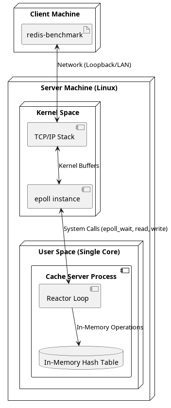
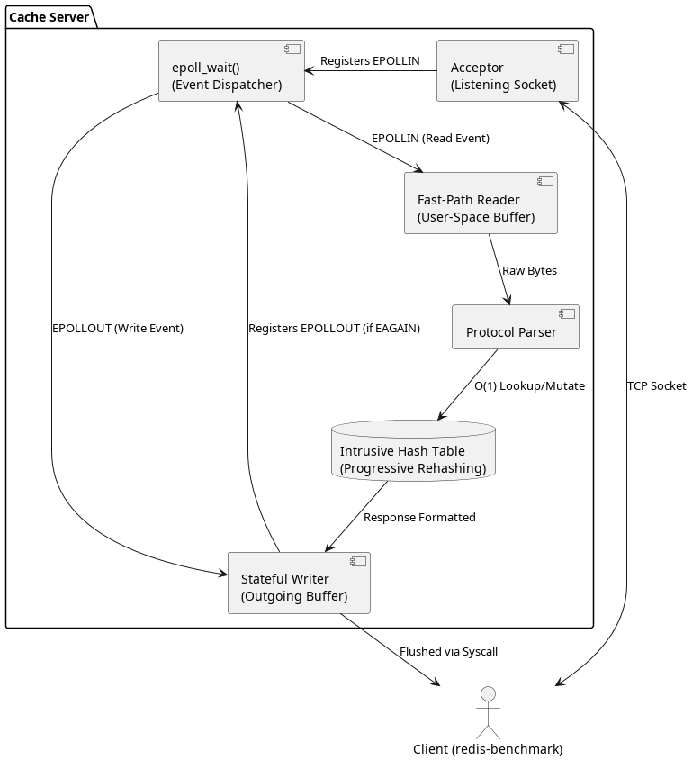
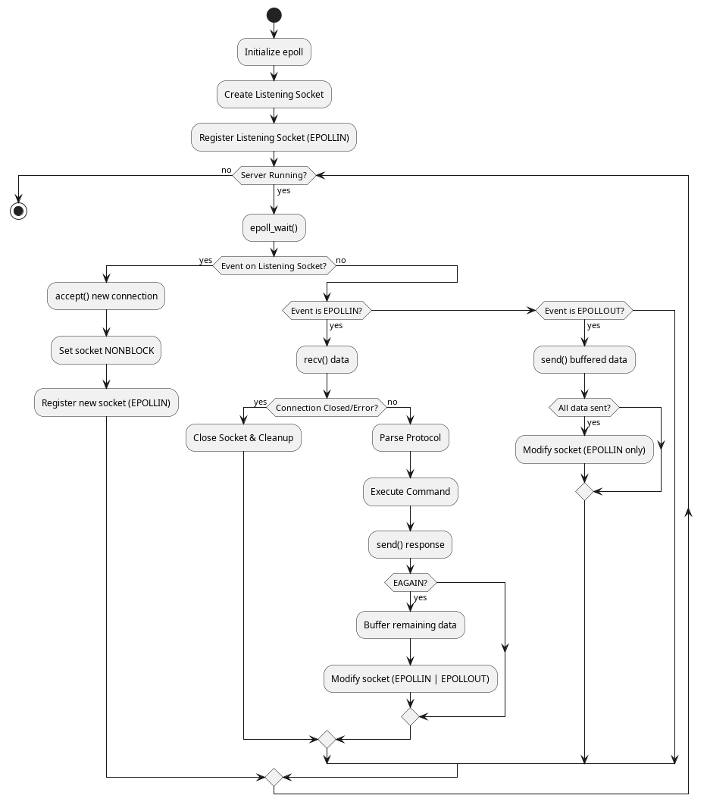
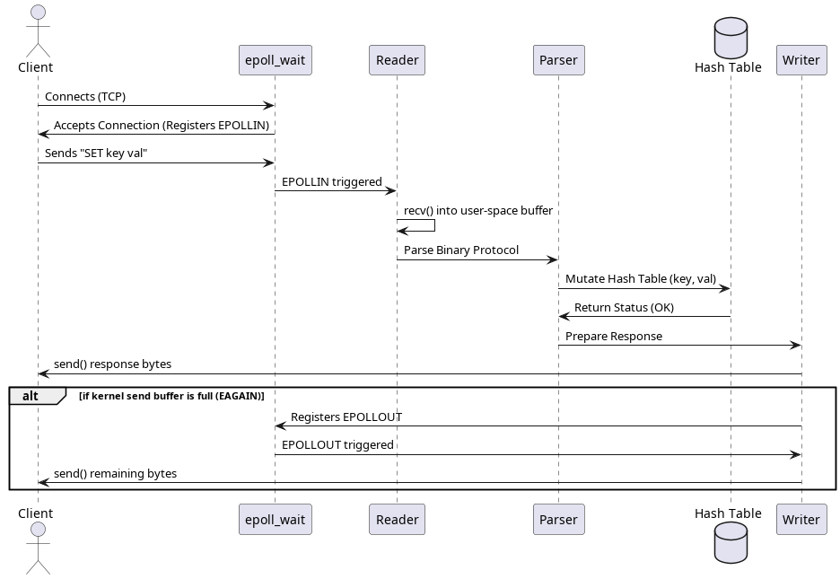

# Cache Server Architecture Document

## 1. Purpose
The purpose of this project is to implement an ultra-high-throughput, low-latency in-memory key-value store from scratch. Designed primarily as an engineering deep-dive into high-performance networking, the system bypasses heavy abstractions to interact directly with Linux kernel APIs (`epoll`, sockets). The goal is to demonstrate how to efficiently solve the C10K problem and maximize raw single-thread execution speed without relying on frameworks like Boost.Asio or libuv.

## 2. Scope
**In-Scope:**
- Bare-metal TCP/IP networking using non-blocking sockets.
- Single-threaded event-driven reactor loop using `epoll`.
- Custom length-prefixed binary framing protocol.
- O(1) in-memory storage using a custom intrusive hash table with progressive rehashing.
- Core commands: `SET`, `GET`, `DEL`.

**Out-of-Scope (Currently):**
- Disk persistence.
- horizontal sharding.
- Advanced data structures.

## 3. System Overview
A high-throughput, low-latency in-memory key-value store built entirely from scratch in C++ for Linux. Designed to maximize single-thread performance, this project implements a custom intrusive hash table and a highly optimized TCP network stack directly on top of Linux system calls, bypassing high-level abstractions to work directly with the kernel.

## 4. Core Components
*   **Bare-Metal Networking:** Built without external dependencies or heavy frameworks. Relies purely on Linux socket APIs.
*   **Event-Driven Reactor Pattern:** Utilizes level-triggered `epoll` to handle massive concurrency (the C10K problem) efficiently, achieving O(1) event notification complexity.
*   **Zero-Copy & Stateful I/O:** Implements a custom state machine to handle non-blocking I/O (`EAGAIN`/`EWOULDBLOCK`), partial reads/writes, and kernel buffer backpressure gracefully without blocking the event loop.
*   **Progressive Rehashing:** Implements a custom intrusive hash table utilizing separate chaining. To prevent catastrophic latency spikes during dynamic resizing, the table performs incremental bucket migrations across two internal tables (`older` and `newer`) over successive operations. Uses the FNV-1a string hashing algorithm.

## 5. Protocol Specification
To eliminate the CPU overhead of parsing text strings, this server uses a custom length-prefixed binary framing protocol. This allows the server to parse commands instantly using simple pointer arithmetic and zero-copy memory mapping.

**Packet Byte Structure:**
| Offset | Size (Bytes) | Field Name | Description |
| :--- | :--- | :--- | :--- |
| `0x00` | 4 | `num_arguments` | Total number of arguments in the command |
| `0x04` | 4 | `arg1_length` | Length of the first argument (`N`) |
| `0x08` | `N` | `arg1_data` | Raw bytes of the first argument |
| `0x08 + N` | 4 | `arg2_length` | Length of the second argument (`M`) |
| `0x0C + N` | `M` | `arg2_data` | Raw bytes of the second argument |

*Example for `GET mykey`:* `[0x00000002] [0x00000003][GET] [0x00000005][mykey]`

## 6. Internal Mechanics Deep Dive
The core of the server is a reactor pattern powered by `epoll_wait`. 

### 6.1. Request Lifecycle

1. **Acceptor:** A non-blocking listening socket accepts incoming TCP connections and registers them with the `epoll` instance with `EPOLLIN` interest.
2. **Fast-Path Reading:** When data arrives, the server reads into a pre-allocated per-connection buffer. If a complete message is framed according to the custom protocol, it is immediately executed.
3. **Stateful Writing:** Responses are written directly to the socket. If the kernel's TCP send buffer fills up (`EAGAIN`), the remaining data is buffered in user-space, and the socket state is mutated to watch for `EPOLLOUT`. The event loop automatically resumes sending when the socket becomes writable.

## 7. Performance Benchmarks
All benchmarks were executed on an Intel Core Ultra 7 255HX (20 cores) using `redis-benchmark` over the loopback interface (`127.0.0.1`). The server operates on a **single thread**.

### 7.1 Pipelined Workloads (Max Throughput)
By utilizing pipelining (`-P 16`), the client sends batches of 16 commands at once, bypassing the network RTT bottleneck.

| Command | Throughput (RPS) | p50 Latency | p99 Latency |
| :--- | :--- | :--- | :--- |
| **SET** | **4,251,339 req/s** | 0.18 ms | 0.36 ms |
| **GET** | **4,204,684 req/s** | 0.18 ms | 0.36 ms |
| **DEL** | **5,265,275 req/s** | 0.14 ms | 0.35 ms |

### 7.2 The C10K Test (High Concurrency)
The server gracefully managed 10,000 concurrent connections on a single thread.

| Command | Concurrent Clients | Requests | Throughput | p50 Latency |
| :--- | :--- | :--- | :--- | :--- |
| **SET** | 10,000 | 10M | 246,530 req/s | 40.35 ms |
| **GET** | 10,000 | 10M | 249,843 req/s | 39.80 ms |

## 8. Future Enhancements
- **Multi-threading Architecture:** Transition from a single-threaded reactor to a multi-threaded architecture utilizing `std::shared_mutex` for global state synchronization.
- **Time-To-Live (TTL):** Active and passive key expiration mechanisms.
- **Persistence:** background snapshotting to prevent data loss on restarts.

## 9. Risks and Mitigations
| Risk | Mitigation Strategy |
| :--- | :--- |
| **Out of Memory (OOM) Crashes** | Currently bounded only by physical RAM. Mitigated in future via the LRU eviction policy enhancement. |
| **Single Thread Bottleneck** | A single CPU core can max out at ~5.2M RPS. Mitigated in future by transitioning to a multi-threaded architecture. |
| **Data Loss on Failure** | As an in-memory datastore, process termination results in total data loss. Mitigated by restricting to caching use-cases until Disk Persistence is implemented. |
| **Slow Client Backpressure** | Malicious or slow clients failing to read data could fill server buffers. Mitigated by the stateful `EPOLLOUT` buffer limits and strict connection dropping on timeouts. |
